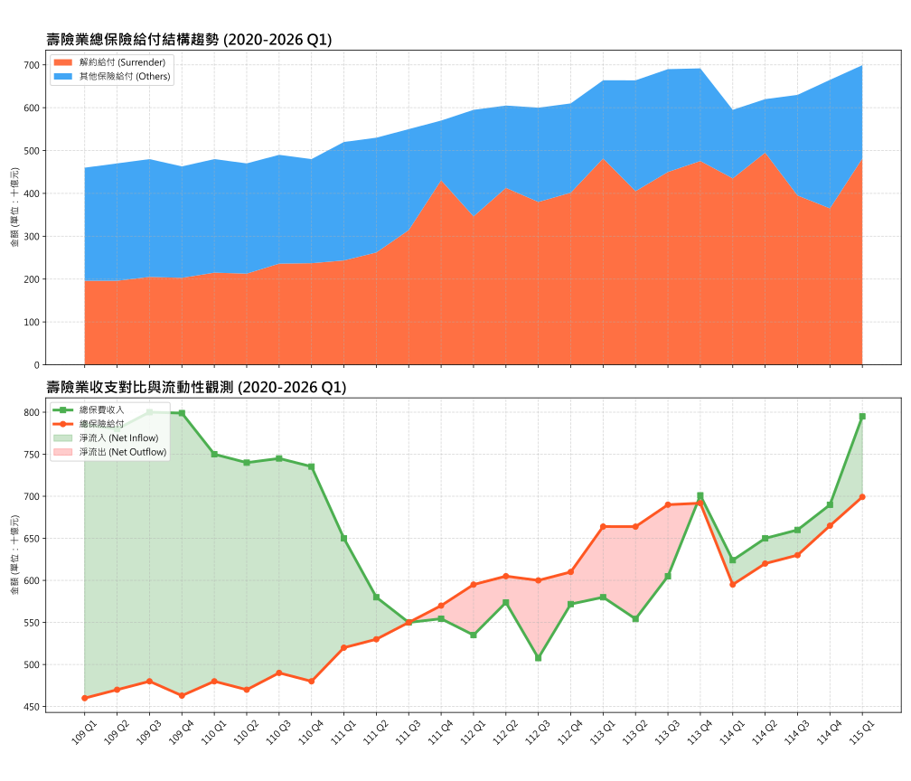
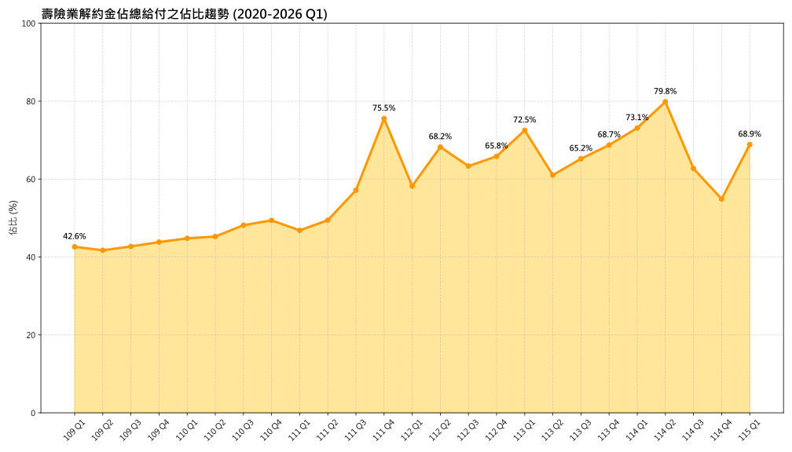

# 台灣壽險業業績統計與解約潮分析 (2020 - 2026 Q1)

本專案旨在自動化收集、整合並視覺化台灣壽險業的核心財務數據，特別關注近年來由全球升息及台股熱潮引發的「保單解約潮」現象。

## 📊 趨勢視覺化

### 1. 業績趨勢與給付結構 (仿 TaiwanHouse 風格)
下圖採用堆疊面積圖與對比趨勢圖，呈現壽險業金流動態。
- **上圖 (堆疊面積)：** 展示總給付中「解約給付」所佔的絕對份量及其增長。
- **下圖 (收支對比)：** 呈現總保費與總給付的缺口，紅色區域標示出淨流出（流動性壓力）時段。

### 2. 給付結構變化
此圖呈現解約金佔總保險給付的比例。從 2020 年約 **40%** 的水準，一路攀升至 2026 Q1 的 **68.9%**。

## 📁 數據說明
數據整合自 **壽險公會 (LIA-ROC)** 與 **保發中心 (TII)** 的官方業績統計報表。

- **數據路徑：** `data/raw_life_insurance_statistics_2020_2026.csv`
- **欄位定義：** `data/raw_column_definition_life_insurance_statistics_2020_2026.md`

## ⚙️ 自動化腳本
1. **數據獲取與整合：** `python scripts/FetchLifeInsuranceData.py`
2. **趨勢視覺化：** `python scripts/VisualizeLifeInsuranceData.py`

## 🔗 相關來源
- [2026/05/23 新聞：台股誘人…引爆保單解約潮](https://udn.com/news/story/7239/8750241)
- [壽險公會統計專區](https://www.lia-roc.org.tw/index06/statis/statis.htm)
- [保發中心統計資料庫](https://www.tii.org.tw/tii/information/statistics/report/life/)
